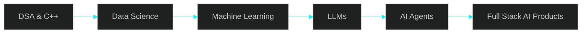

<div align="center">


<br/>

<a href="https://github.com/abhishekadbhute-create">
  
</a>

<br/>


</div>

<br/>

<div align="center">


</div>

## ⚡ &nbsp;AI SYSTEM STATUS

<div align="center">

<table>
<tr>
<td width="100%">

```yaml
┌────────────────────────────────────────────────────────────────┐
│  ▓▓▓▓▓▓▓▓▓▓▓▓▓▓▓▓▓▓▓▓  NEURAL CORE // BOOT LOG  ▓▓▓▓▓▓▓▓▓▓▓▓▓▓▓│
├────────────────────────────────────────────────────────────────┤
│                                                                │
│   USER ................. Abhishek Adbhute                      │
│   STATUS ................  ONLINE                              │
│   ROLE .................. ECE Student           │
│   COLLEGE ............... IIIT Naya Raipur                     │
│   MISSION ............... Build Intelligent AI Applications    │
│   LOCATION .............. India                                │
│                                                                │
│   CURRENT TARGETS:                                             │
│     ▸ Machine Learning        [ACTIVE]                         │
│     ▸ Data Science            [ACTIVE]                         │
│     ▸ Large Language Models   [TRAINING]                       │
│     ▸ AI Agents               [TRAINING]                       │
│     ▸ Full Stack Development  [ACTIVE]                         │
│                                                                │
│   LEETCODE STREAK ....... 200+ Problems Solved                 │
│                                                                │
└────────────────────────────────────────────────────────────────┘
```

</td>
</tr>
</table>

</div>

<br/>

## 🧬 &nbsp;ABOUT THE SYSTEM


- 🎓 &nbsp;Computer Science student at **IIIT Naya Raipur**
- 🧠 &nbsp;Deep diving into **Machine Learning**, **Data Science** & **LLMs**
- 🤖 &nbsp;Currently engineering autonomous **AI Agents**
- 💻 &nbsp;Full Stack Developer building end-to-end AI products
- 🧩 &nbsp;**200+ LeetCode** problems solved — sharpening DSA daily
- ⚡ &nbsp;Fluent in **C**, **C++**, **Python**
- 🌱 &nbsp;Exploring **LangChain**, **Hugging Face** & Generative AI pipelines
- 🎯 &nbsp;Goal: Ship production-grade AI applications that matter
- 📡 &nbsp;Ask me about: `Machine Learning` `LLMs` `AI Agents` `DSA`

<br clear="right"/>

<div align="center">


</div>

<div align="center">


## 🛠️ &nbsp;TECH ARSENAL

<div align="center">

### 💠 Programming Languages
<br/><br/>

### 💠 Machine Learning & Data Science


<br/><br/>

### 💠 Generative AI

<br/><br/>

### 💠 Tools & Platforms


</div>

<br/>


## 📡 &nbsp;LIVE SYSTEM TELEMETRY

<div align="center">


<br/>


<br/><br/>


</div>

<br/>

## 🏆 &nbsp;LEETCODE CORE

<div align="center">


<br/>


</div>

<br/>

## 🗺️ &nbsp;CURRENT LEARNING ROADMAP

<div align="center">



</div>

<br/>


## 📞 &nbsp;ESTABLISH CONNECTION

<div align="center">

<a href="https://github.com/abhishekadbhute-create">

</a>
<a href="https://linkedin.com/in/abhishek-adbhute-79b295383">

</a>
<a href="https://leetcode.com/u/AbhishekA2021/">

</a>
<a href="mailto:abhishekadbhute@gmail.com">

</a>

</div>

<br/>

<div align="center">

```
╔═══════════════════════════════════════════════════════════════════════╗
║        "Building the future, one commit at a time." — A.A              ║
╚═══════════════════════════════════════════════════════════════════════╝
```


</div>
